# Orquestração de Workflows utilizando Kestra

Este repositório contém um arquivo **docker-compose**, utilizado para implantar serviços que permitem o uso local do **Kestra** para testes de ETL além de uma pasta chamada 'flows', que contém os códigos de todas as pipelines desenvolvidas durante os testes.

## Docker Compose

De forma geral, o arquivo **docker-compose** deste diretório implanta 3 serviços localmente: o **Kestra** (que possui um serviço interno de armazenamento configurado utilizando PostgreSQL), uma instância separada do PostgreSQL para os testes de ETL e o **PGAdmin** para consultas aos dados dos testes locais.

## Uso de Cloud (GCP)

O **BigQuery** e os **buckets do Google Cloud Storage** foram utilizados em um segundo cenário de testes de ETL, como alternativa ao modelo on-premise. O **Terraform** foi utilizado para provisionar ambos os recursos, através da criação de um usuário de serviço.

Arquivos de provisionamento: https://github.com/vinicius-moreira-maia/DE_ZC/tree/main/01-DockerPostgresGCPTerraform/terrademo 

## Arquivos da pasta kestra-flows

Os arquivos que contêm "postgres" no nome são os que definem o ETL no modelo on-premise, enquanto os que possuem "gcp" são os que definem o ETL no modelo cloud.

Ambos os cenários funcionam basicamente da mesma forma. São feitas parametrizações com valores pré-definidos nos arquivos base (**01_postgres_taxi.yml** e **06_gcp_taxi.yml**) para garantir que os nomes dos datasets sejam corretamente formados e para servir de inputs para os passos seguintes.

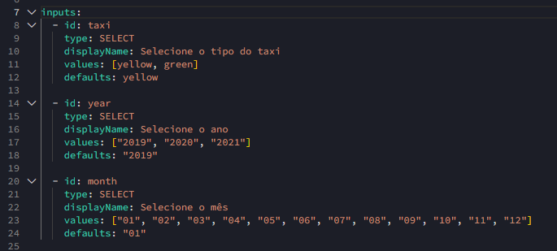

A partir desses inputs, são definidas variáveis que são referenciadas por todo o pipeline durante as três etapas: **E** (Extração), **T** (Transformação) e **L** (Carga).

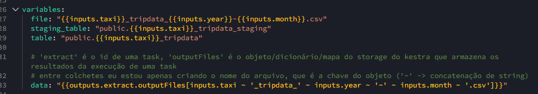

Nos dois casos, o dataset (em CSV) é baixado utilizando a mesma task. 

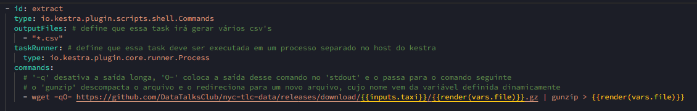

#### No caso do PostgreSQL:

São definidas duas tasks principais em uma estrutura condicional: **if_yellow_taxi** e **if_green_taxi**. Em ambos os casos, o processo do pipeline segue as seguintes etapas:

**1.**** A tabela principal é criada, caso não exista.

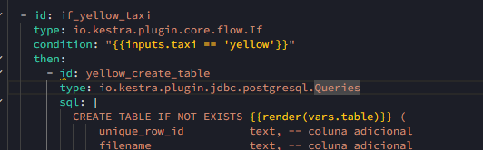

**2.** A tabela de staging é criada, caso não exista.

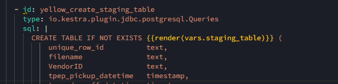

**3.** É realizado um **truncate** na tabela de staging para garantir que não haja dados residuais de outras cargas.

**4.** O dataset em CSV é copiado para a tabela de staging.

**5.** A tabela de staging é atualizada criando hashes para cada registro único, utilizando a função **md5**.

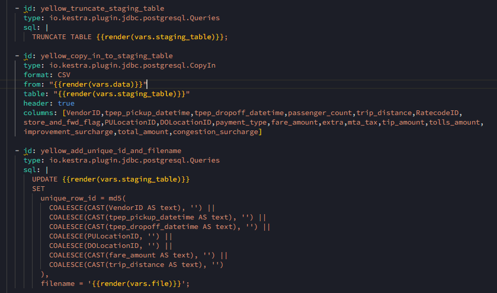

**6.** É feito um **MERGE** entre a tabela de staging e a tabela principal para que apenas registros inéditos sejam adicionados à tabela definitiva. 

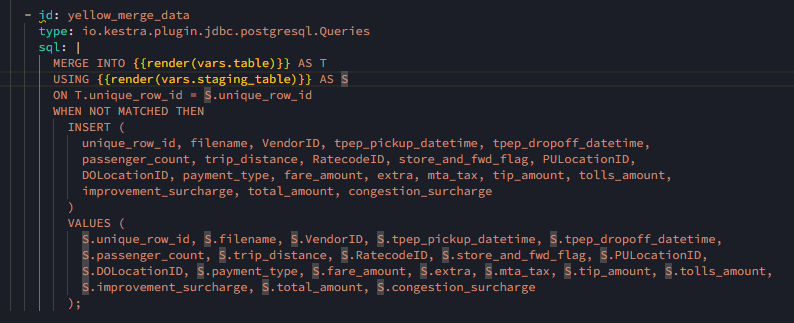

**7.** Por fim, o arquivo CSV baixado é removido do storage do Kestra.

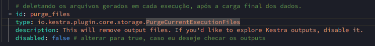

#### No caso do GCP:

São definidas duas tasks principais em uma estrutura condicional: **if_yellow_taxi** e **if_green_taxi**. Em ambos os casos, o processo do pipeline segue as seguintes etapas:

**1.** O CSV é copiado para o **Data Lake (bucket)**.

**2.** A tabela principal é criada no BigQuery, caso não exista.

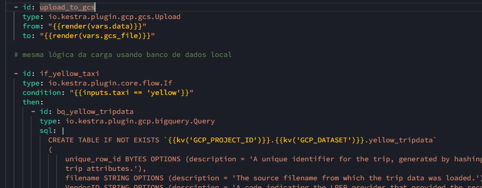

**3.** Os dados do CSV são consultados através de uma **EXTERNAL TABLE**, para que o BigQuery consuma os dados sem realizar replicação.

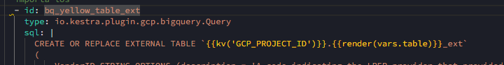

**4.** A partir da consulta da **EXTERNAL TABLE**, é criada uma nova tabela, já fazendo o hash (**md5**) para garantir a unicidade de cada registro.

**5.** Por fim, é feito um **MERGE** entre a tabela principal e a tabela que contém os hashes.

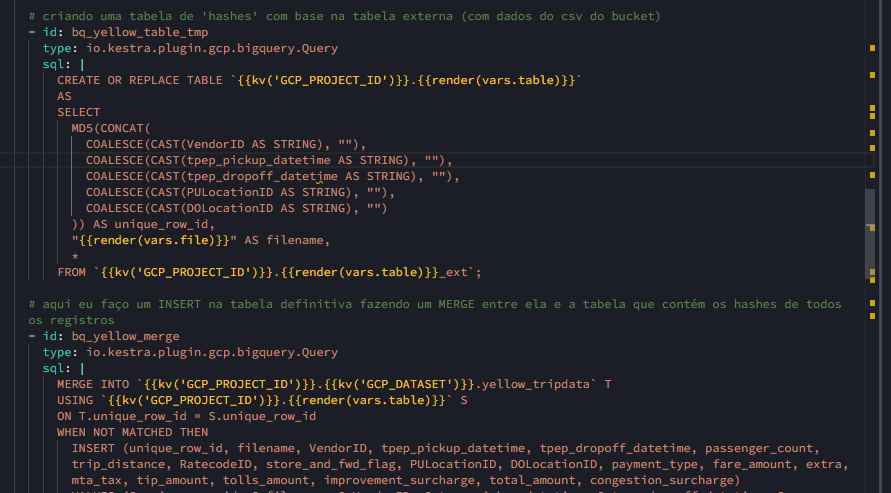

#### NO/LOW Code

Todos esses passos configurados no YAML podem ser feitos através da interface gráfica (GUI), e ambos são sincronizados em tempo real.

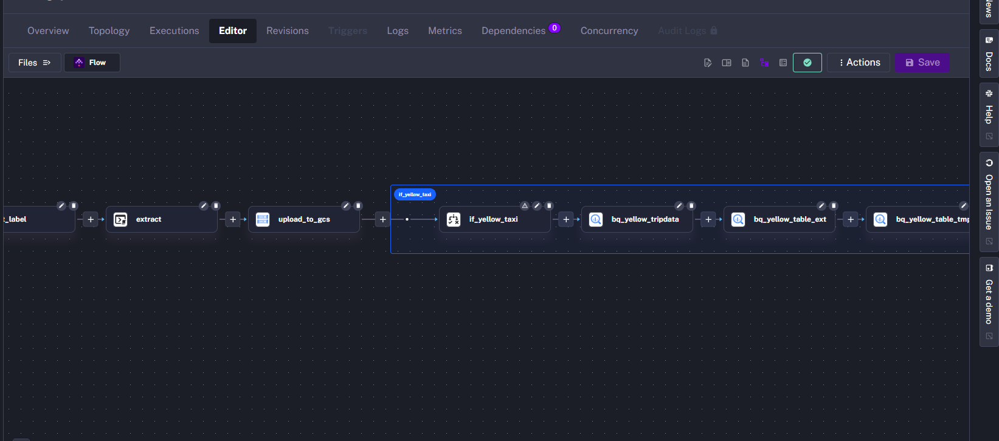

#### Backfills e dbt

Para ambos os pipelines, há testes de **Backfill** (carga de dados do passado) e testes do uso de **dbt** para a criação de modelos analíticos sobre os dados brutos.

---

### English Version

# Workflow Orchestration with Kestra

This repository contains a **docker-compose** file used to deploy services that allow local use of **Kestra** for ETL testing, as well as a folder called 'flows' that contains the code for all the pipelines developed during testing.

## Docker Compose

In general, the **docker-compose** file in this directory deploys 3 services locally: **Kestra** (which has an internal storage service configured using PostgreSQL), a separate instance of PostgreSQL for ETL testing, and **PGAdmin** for querying the data from the local tests.

## Cloud Usage (GCP)

**BigQuery** and **Google Cloud Storage buckets** were used in a second ETL testing scenario as an alternative to the on-premise model. **Terraform** was used to provision both resources by creating a service account.

Terraform files: https://github.com/vinicius-moreira-maia/DE_ZC/tree/main/01-DockerPostgresGCPTerraform/terrademo 

## kestra-flows Folder Files

Files containing "postgres" in their names define the ETL process in the on-premise model, while those containing "gcp" define the ETL process in the cloud model.

Both scenarios essentially work the same way. Parametrizations with pre-defined values are made in the base files (**01_postgres_taxi.yml** and **06_gcp_taxi.yml**) to ensure the datasets' names are correctly formed and to serve as inputs for the subsequent steps.

From these inputs, variables are defined and referenced throughout the pipeline during the three stages: **E** (Extract), **T** (Transform), and **L** (Load).

In both cases, the dataset (in CSV format) is downloaded using the same task. 

#### In the PostgreSQL case:

Two main tasks are defined in a conditional structure: **if_yellow_taxi** and **if_green_taxi**. In both cases, the pipeline process follows these steps:

**1.** The main table is created if it doesn't exist.

**2.** The staging table is created if it doesn't exist.

**3.** A **truncate** is performed on the staging table to ensure there are no residual data from previous loads.

**4.** The CSV dataset is copied to the staging table.

**5.** The staging table is updated by creating hashes for each unique record using the **md5** function.

**6.** A **MERGE** is performed between the staging table and the main table to ensure that only new records are added to the final table.

**7.** Finally, the downloaded CSV file is removed from Kestra's storage.

#### In the GCP case:

Two main tasks are defined in a conditional structure: **if_yellow_taxi** and **if_green_taxi**. In both cases, the pipeline process follows these steps:

**1.** The CSV is copied to the Data Lake (bucket).

**2.** The main table is created in BigQuery if it doesn't exist.

**3.** The CSV data is queried through an **EXTERNAL TABLE** so that BigQuery consumes the data without replicating it.

**4.** From the **EXTERNAL TABLE** query, a new table is created, applying the hash (**md5**) to ensure the uniqueness of each record.

**5.** Finally, a **MERGE** is performed between the main table and the table containing the hashes.

#### NO/LOW Code

All of these steps configured in the YAML file can also be performed through the graphical user interface (GUI), and both are synchronized in real-time.

#### Backfills and dbt

Both pipelines include **Backfill** tests (loading past data) and tests using **dbt** for creating analytical models on raw data.
